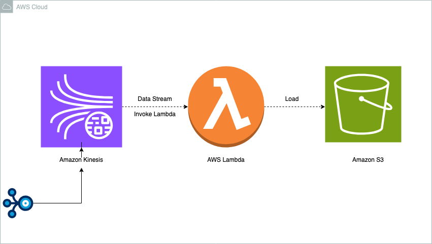

# Data Lake Architecture for Kinesis Stream Events

This document describe the architecture and design considerations for creating a data lake.
Which processes events coming from a Kinesis stream on Amazon Web Services. The solution uses AWS
services to handle large volumes of data, perform data processing tasks.

## Code
* `lambda.py`: code for lambda function.
* `tests/`:  contain unit test.
* `data_structure`: for simple data structure.
* `terraform/`: This configuration creates an AWS environment with a Kinesis stream and a Lambda function connected to ingest and process events.

> **Note:** Please check the code as I did not test it by running makefile. I tried my best to put everything there.

## Architecture Diagram

## Technologies Chosen and Why

- **Amazon Kinesis**: Real-time data streaming service.
- **AWS Lambda**: Serverless compute service for running code in response to events.
- **Amazon S3**: Scalable object storage for data lake storage.

## Design Questions

### How would you handle duplicate events?

Duplicate events can be handled by implementing duplication logic in Lambda function. We can use `event_uuid` to check duplicates
before processing an event.

Duplication logic I have written in code checks if an event with same `event_uuid` already exists in table then override it with new one.

### How would you partition the data to ensure good querying performance and scalability?

We can partition the data by `event_type` and `event_subtype` to optimize query performance.

This strategy allows for efficient querying of specific event types and subtypes, as it reduces the amount of data that 
needs to be scanned during queries. By organizing data in this manner, we can ensure that queries are fast and scalable,
even as the volume of data grows.

### What format would you use to store the data?

For storing the data, we can use the Parquet format. `Parquet` is a highly efficient for analytics queries.
It offers compression, which reduces storage costs, and supports schema evolution, allowing for modifications to the 
schema over time.

If further data from S3 bucket is used by Athena or Glue then `JSON` format would be my choice. Because `JSON` format
is easily queryable with these tools.

### How would you test the different components of your proposed architecture?

* Use unit tests for Lambda function.
* Integration tests to simulate Kinesis stream events.
* End-to-Ending testing, Monitor the flow of data from Kinesis -> Lambda -> s3.

### How would you ensure the architecture deployed can be replicable across environments?

We can use Terraform for infrastructure as code, It allows easy replication of the architecture across environments.

### Would your proposed solution still be the same if the amount of events is 1000 times smaller or bigger?

The proposed solution would remain largely the same, with adjustments made as necessary to accommodate changes in the 
volume of events. The architecture is designed to be scalable, with components like Amazon S3  capable of handling 
varying volumes of data.

### Would your proposed solution still be the same if adding fields / transforming the data is no longer needed?

If the transforming the data is no longer needed, the solution would still be valid but might be simplified.
The Lambda function is responsible for processing and transforming events might be simplified or removed entirely
if no transformations are required.
